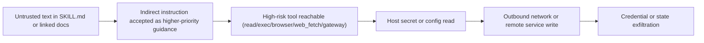
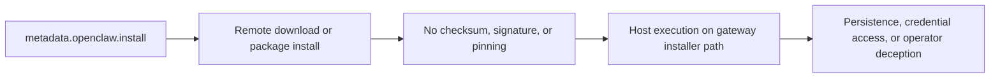
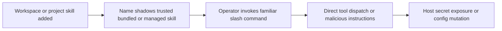

# OpenClaw Threat Model

The verifier cannot treat a skill as an isolated Markdown file. In OpenClaw, a skill participates in a runtime that has source precedence, delegated tool authority, host-only secret injection, sandbox asymmetry, and installer pathways with different trust boundaries.

## Why isolated linting is not enough

A generic skill scanner can answer:

- does this file contain suspicious strings?
- does this repo include obvious shell payloads?

An OpenClaw-aware verifier must answer harder questions:

- which source wins if this skill collides with a trusted bundled skill?
- is the skill hidden from the model but still directly user-invocable?
- can it reach host secrets through `skills.entries.<skillKey>.env` or `apiKey`?
- does it induce auto-install or manual copy-paste execution?
- does it need host execution even when the session is otherwise sandboxed?
- can multiple benign-looking signals combine into a real attack path?

## Trust Boundaries

### Ingestion boundaries

OpenClaw skills may enter from:

- bundled skills
- managed `~/.openclaw/skills`
- personal `~/.agents/skills`
- project `<workspace>/.agents/skills`
- workspace `<workspace>/skills`
- `skills.load.extraDirs`
- plugin-provided skill directories
- ClawHub installs
- gateway-backed installer metadata
- generated workspace skills such as Skill Workshop outputs

Every source has different provenance and different shadowing power.

### Execution boundaries

Relevant runtime planes:

- model prompt exposure plane
- user slash-command plane
- tool-dispatch plane
- host process env plane
- sandboxed tool plane
- gateway host plane
- config mutation plane

Risk emerges when a skill crosses multiple planes at once.

## OpenClaw-specific attack surfaces

### Precedence and shadowing

Because workspace skills override project, personal, managed, bundled, and extra-dir skills, a same-name workspace skill can replace a trusted command or workflow even when the underlying content is not obviously malicious.

This creates:

- trusted-name hijack
- social-engineering via familiar homepage/name/emoji
- update confusion when a new local skill silently wins resolution

### Delegated tool authority

`command-dispatch: tool` changes the control model:

- the model can be bypassed
- operator-visible slash commands become direct tool invocations
- `command-tool` becomes part of the security boundary

When combined with:

- `disable-model-invocation: true`
- `user-invocable: true`
- tools with side effects

the skill can become both less visible and more dangerous.

### Host secret injection

OpenClaw explicitly supports:

- `skills.entries.<skillKey>.env`
- `skills.entries.<skillKey>.apiKey`
- `metadata.openclaw.primaryEnv`
- `metadata.openclaw.requires.env`

These features are useful, but they also mean a skill can have host-secret reachability without containing any hardcoded secret-handling code.

The verifier therefore needs to model targets such as:

- `~/.openclaw/openclaw.json`
- `~/.openclaw/credentials/**`
- `agents/<agentId>/agent/auth-profiles.json`
- `secrets.json`
- `.env`
- `.npmrc`
- `.netrc`
- `.pypirc`
- `.docker/config.json`
- `~/.ssh/**`
- browser credential stores
- Windows Credential material and browser Login Data files

### Install-path asymmetry

There are at least two materially different install stories:

- gateway-backed installer metadata in `metadata.openclaw.install`
- `openclaw skills install <slug>` downloading a skill folder into workspace `skills/`

The first can trigger host-side package/download actions.
The second changes precedence by landing in a high-priority workspace location.

A verifier that only checks `SKILL.md` text misses both the auto-install path and the precedence consequence.

### Prompt injection and indirect instruction

OpenClaw’s recent fixes show that prompt injection is not theoretical. It can arrive through:

- `SKILL.md` body
- README or examples
- copied shell snippets
- external URLs
- fetched web pages
- downloaded docs
- comments and setup scripts
- wrapped external content with role-boundary markers

The dangerous pattern is rarely one sentence alone. The danger is:

- untrusted content
- treated as higher-authority guidance
- steering a high-risk tool
- toward host reads or outbound transmission

### Host vs sandbox asymmetry

Sandboxing reduces some blast radius, but does not erase risk:

- host-side gateway logic remains on host
- elevated exec bypasses sandboxing
- host-only skill env injection remains relevant
- sandbox package installs may require broader sandbox permissions
- mirrored skills keep instruction content accessible inside the sandbox

So the verifier must score:

- host-only attack paths
- sandbox-resident attack paths
- residual risks that survive sandboxing

## Tool Reachability Model

The verifier should reason about whether the skill can reach or induce use of:

- `exec`
- `browser`
- `web_fetch`
- `web_search`
- `read`
- `write`
- `edit`
- `apply_patch`
- `process`
- `gateway`
- `cron`
- `nodes`

Reachability is not only keyword presence. It can arise from:

- `command-dispatch`
- frontmatter metadata
- examples and slash-command usage
- required config keys
- prompts that instruct the agent to fetch or copy external text

## Example attack path classes

### Attack path: prompt poisoning to secret exfiltration

### Attack path: installer to host compromise

### Attack path: same-name override

## Scoring implications for the new verifier

The final score cannot just be “sum of regex hits”.

It should consider:

- evidence strength
- source precedence
- install path
- direct tool dispatch
- secret reachability
- egress reachability
- host vs sandbox
- attack-path completeness

Suggested confidence classes:

- `high`: directly evidenced dangerous primitive
- `medium`: strong heuristic with nearby supporting context
- `low`: weak heuristic or educational mention
- `inferred/compound`: danger emerges from composed evidence nodes

## What must remain explainable

For each serious finding, the report should say:

- what text or metadata triggered concern
- why that is risky specifically in OpenClaw
- which prerequisites are already satisfied
- which prerequisites are inferred but not proven
- whether a realistic attack path is already complete
- why the verdict is `allow`, `warn`, or `block`

## Static-analysis limits

Static analysis alone cannot fully determine:

- whether a referenced URL is currently malicious
- whether a package registry account is compromised
- whether operator-specific config makes a tool reachable right now
- whether a given secret is actually populated at runtime
- whether a browser or remote node has additional ambient authority
- whether a human operator will copy-paste a manual command

That is why the Phase 4+ design should support:

- dynamic validation hooks
- provenance/reputation overlays
- optional signature or digest verification
- baseline and suppression workflows with audit trails

The verifier should therefore be honest about uncertainty while still surfacing dangerous compositions early.

